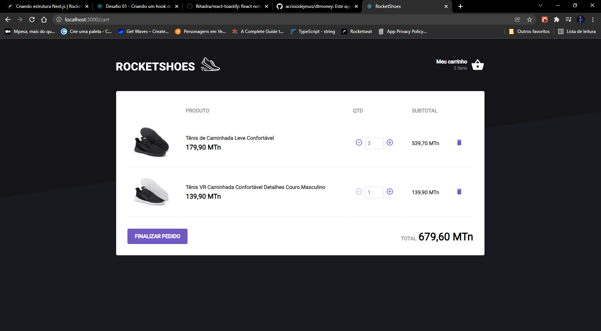

# Rocketshoes - Desafio criação de hooks no ReactJs - Ignite

O desafio proposto foi a criação das funcionalidades do hook que controla o carrinho da loja, compartilhando os dados dos produtos com a pagina inicial e a pagina do carrinho. Através deste desafio foram consolidados conhecimentos sobre:
* useContext
* Hooks personalizados
* useState
* useEffect
* useRef

E mais...

 

